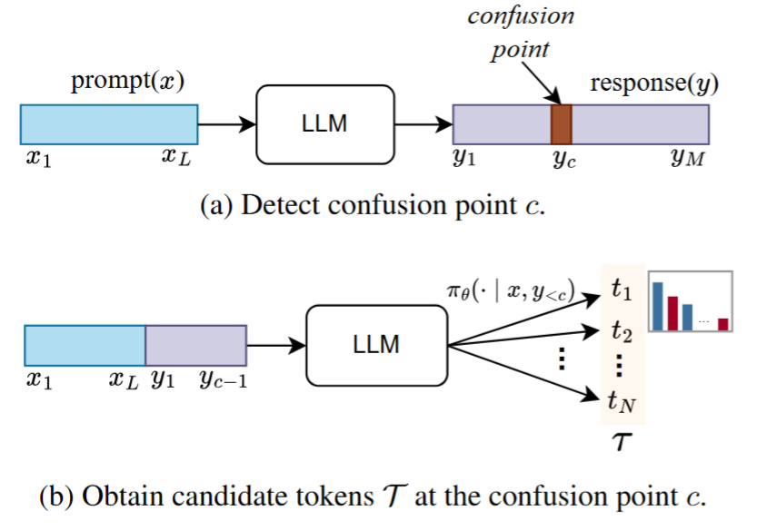
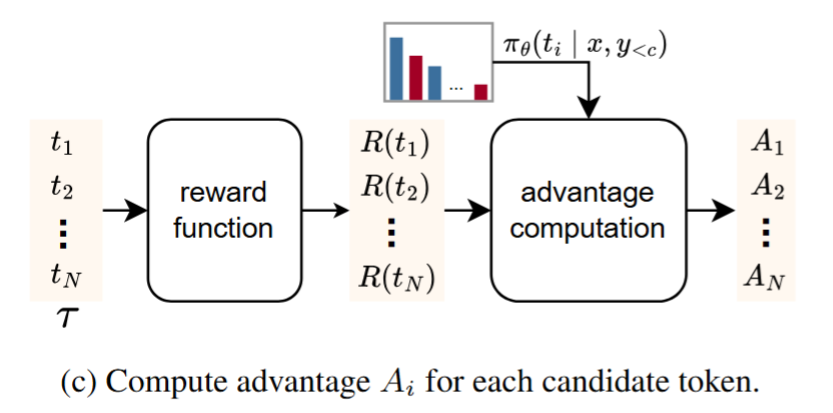

# TLPO: Token-Level Policy Optimization for Mitigating Language Confusion in Large Language Models

### This repository contains the official implementation of **TLPO: Token-Level Policy Optimization for Mitigating Language Confusion in Large Language Models** (ACL 2026).

<p align="center">
  
  
</p>


## Overview

TLPO is a token-level policy optimization method designed to reduce unintended language switching (language confusion) in multilingual large language models.

This codebase provides:
- TLPO training pipeline (`main.py`, `dataset`, `trainer`)
- Training data preparation scripts (`tools/filter_data`)
- Evaluation scripts and custom tasks (`tools/evaluation`)

## Repository Structure

- `main.py`: training entry point for TLPO
- `trainer/`: trainer implementations (`tlpo`)
- `dataset/`: dataset loaders and language confusion detector
- `tools/filter_data/`: scripts for Bactrian-X filtering and training set construction
- `tools/evaluation/`: lm-evaluation-harness tasks and TLPO-specific post-evaluation script
- `images/`: figures used in this README

## Environment Setup

```bash
pip install -r requirements.txt
```

## Data and Model Layout

`main.py` uses `DATA_DIR=/data/dataset` by default. Update this in `main.py` if your storage path is different.

Expected structure:

```text
/data/dataset/
  Bactrian-X-filtered/
    data/
      ko.json
      zh.json
      ar.json
      ja.json
  gsm8k-platinum/
    main/
      test-00000-of-00001.parquet
  pretrained_model/
    Meta-Llama-3.1-8B-Instruct/
    Qwen3-8B/
    gemma-3-4b-it/
    Ministral-8B-Instruct-2410/
```

## Training Data Preparation (Bactrian-X)

Reference dataset:
- Bactrian-X: https://huggingface.co/datasets/MBZUAI/Bactrian-X

Notes:
- SFT uses the **reference dataset (Bactrian-X)**.
- TLPO and GRPO use the dataset produced by **Step 1) Filter source questions**.
- DPO and ORPO use the dataset produced by running **Step 1) + Step 2) + Step 3)**.


### 1) Filter source questions

Purpose:
- Filter out prompts containing language names and development/terminal-related keywords.
- Keep clean question prompts for language-confusion-focused training.

Output:
- `dataset/Bactrian-X-filtered/data/{target_language}.json`

Path note:
- `dataset/Bactrian-X` is the local path where the reference Bactrian-X dataset is stored.

```bash
python tools/filter_data/train_data_filter.py \
  --dataset_dir dataset/Bactrian-X \
  --output_dir dataset/Bactrian-X-filtered/data \
  --target_language ko
```


Supported `--target_language` values: `ko`, `zh`, `ar`, `ja`

### 2) Sample model responses (16 per prompt)

Purpose:
- For each filtered question, sample 16 responses from a model.
- Build `question` + `answer[16]` data for confusion-aware pair construction.

Output:
- `{dataset_dir}/{model_type}/{target_language}.jsonl`

```bash
python tools/filter_data/make_bactrian_sample.py \
  --dataset_dir dataset/Bactrian-X-filtered/data \
  --model_type llama \
  --model_path meta-llama/Llama-3.1-8B-Instruct \
  --target_language ko
```

Run this step for each model tag used by `make_train_dataset.py`:
- `llama`
- `qwen`
- `gemma4b`
- `ministral`

### 3) Build preference-style train data

Purpose:
- Check language confusion for each of the 16 sampled answers.
- Discard examples where confusion count is `0/16` or `16/16`.
- Create pairs:
  - `prompt`: question
  - `chosen`: randomly sampled from non-confusion answers
  - `rejected`: randomly sampled from confusion answers


```bash
python tools/filter_data/make_train_dataset.py \
  --dataset_dir dataset/Bactrian-X-filtered/data \
  --output_dir train_data \
  --target_language ko \
  --ignore_english true
```

Baseline training note:
- Baseline methods excluding TLPO were trained using **Hugging Face TRL**.


## Run TLPO Training

Basic run:

```bash
python main.py
```

Common options:

```bash
python main.py \
  -model_type llama \
  -target_language ko \
```

Supported `-model_type` values: `llama`, `qwen`, `gemma4b`, `ministral`  
Supported `-target_language` values: `ko`, `zh`, `ar`, `ja`

Training outputs are written under `./result/`.

## Evaluation

TLPO evaluation uses **lm-evaluation-harness (v0.4.8)** plus custom tasks in this repository.

Reference:
- https://github.com/EleutherAI/lm-evaluation-harness

### 1) Add custom tasks to lm-evaluation-harness

Copy:
- `tools/evaluation/lm_eval/tasks/gsm8k_platinum_mix`
- `tools/evaluation/lm_eval/tasks/lcb`
- `tools/evaluation/lm_eval/tasks/mif`
- `tools/evaluation/lm_eval/tasks/mmmlu`

to your harness task directory (`lm_eval/tasks`).

### 2) Install lm-evaluation-harness (editable)

After adding the custom tasks, install the harness package in editable mode (run in the `lm-evaluation-harness` repository root):

```bash
pip install -e .
```

### 3) Run harness with `--log_samples`

Generate harness outputs and sample JSONL logs (`samples_*.jsonl`), which are required by `TLPO_eval.py`.

Supported target languages: `ko`, `zh`, `ar`, `ja`

Locale map used by MMMLU tasks:

```text
ko -> KO_KR
zh -> ZH_CN
ar -> AR_XY
ja -> JA_JP
```

Main tasks:
- `arc_challenge_chat`
- `bbh_cot_zeroshot`
- `gpqa_main_cot_zeroshot`
- `gpqa_diamond_cot_zeroshot`
- `gsm8k_platinum_cot_zeroshot`
- `mif_en`
- `score_non_greedy_robustness_math`
- `gsm8k_platinum_mix_{language}`
- `lcb_crosslingual_{language}`
- `lcb_monolingual_{language}`
- `mif_{language}`
- `mmmlu_{locale_map[language]}`

Custom task notes:
- `gsm8k_platinum_mix`: translated prompts from `gsm8k-platinum-cot-llama`
- `mmmlu`: implemented with reference to OpenAI simple-evals
- `mif`: implemented with reference to ifeval task style
- `lcb`: simple LLM generation-based evaluation

### 4) Run TLPO consistency evaluation

```bash
python tools/evaluation/TLPO_eval.py \
  --harness_output_dir harness_output \
  --ignore_english true \
  --target_language ko \
  --output_dir tlpo_output
```

Evaluation notes:
- Use the harness output directory as `--harness_output_dir`.
- Set `--ignore_english true` when English should be excluded from confusion detection.
- `--target_language` should be one of `ko`, `zh`, `ar`, `ja`.
- `--output_dir` is where TLPO evaluation JSON files are saved.


## Evaluation Benchmarks

- ARC: https://huggingface.co/datasets/allenai/ai2_arc
- BBH: https://huggingface.co/datasets/lukaemon/bbh
- GPQA: https://huggingface.co/datasets/Idavidrein/gpqa
- GSM8K Platinum: https://huggingface.co/datasets/madrylab/gsm8k-platinum
- LCB: https://github.com/Cohere-Labs-Community/language-confusion
- MIF: https://huggingface.co/datasets/AIDC-AI/Marco-Bench-MIF
- MMMLU: https://huggingface.co/datasets/openai/MMMLU
- MATH: https://huggingface.co/datasets/EleutherAI/hendrycks_math

## Citation

```bibtex
@inproceedings{tlpo2026,
  title     = {TLPO: Token-Level Policy Optimization for Mitigating Language Confusion in Large Language Models},
  author    = {Choo, Jinho and Lee, JunSeung and Kim, Jimyeong and Song, Yeeho and Hong, S.K. and Kwon, Yeong-Dae},
  booktitle = {Proceedings of ACL},
  year      = {2026}
}
```

## License

This project is licensed under the MIT License. See [`LICENSE.md`](LICENSE.md) for details.
